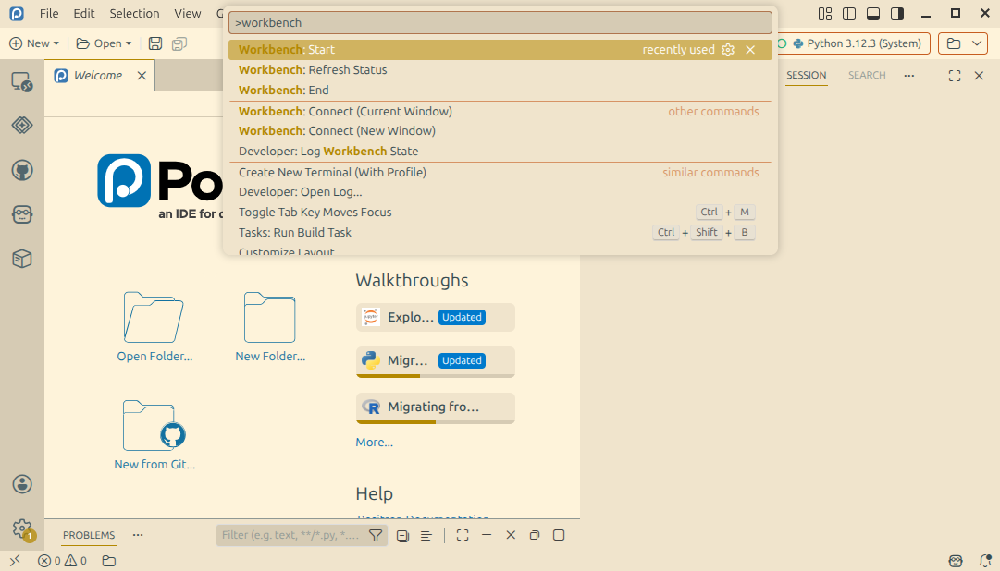
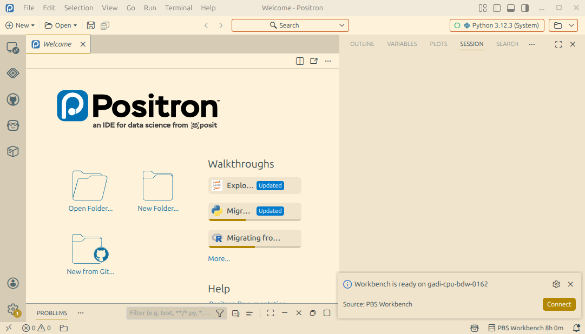

# PBS Workbench

VSCode/Positron extension for managing interactive PBS workbench sessions on Gadi. 

## Requirements

- [pbs-workbench command line tool](https://github.com/eliocamp/pbs-workbench) installed on Gadi.  
  You need to create a default profile. 
- SSH access to Gadi configured without a password prompt (see [these instructions](https://21centuryweather.github.io/21st-Century-Weather-Software-Wiki/vscode/vscode-gadi.html
)).
- SSH configured to connect directly to compute nodes (see [these instructions](https://21centuryweather.github.io/21st-Century-Weather-Software-Wiki/vscode/vscode-gadi-compute-node.html).
- [Open Remote SSH](https://open-vsx.org/extension/jeanp413/open-remote-ssh) or [Remote SSH](https://marketplace.visualstudio.com/items?itemName=ms-vscode-remote.remote-ssh) extension installed. 

## Installation

The extension is [published on the Open VSX Registry](https://open-vsx.org/extension/eliocamp/pbs-workbench).
Install it from the marketplace or by opening the Quick Open menu (Ctrl+P) and pasting the command: 

```
ext install eliocamp.pbs-workbench
```

If your editor doesn't support the Open VSX Registry, you can [download the .vsix file](https://open-vsx.org/extension/eliocamp/pbs-workbench) from the home page and use the Install from VSIX... command. 

## Usage

To start a new workbench, use the command palette (open with `Ctrl+Shift+P` or `Cmd+Shift+P`) and run `Workbench: Start`. 



This will start your default profile. 
An indicator at the bottom right of the screen will show you the status of your workbench and a notification will pop up once it's ready. 
You can connect to the compute node directly by clicking the "Connect" button in the notification. 



Clicking the status bar will also will open a menu with options to connect and stop the workbench. 
